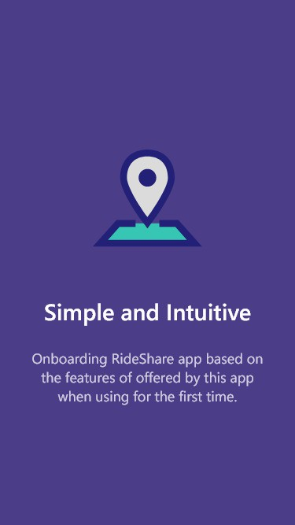
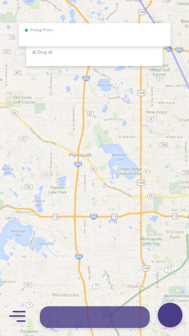
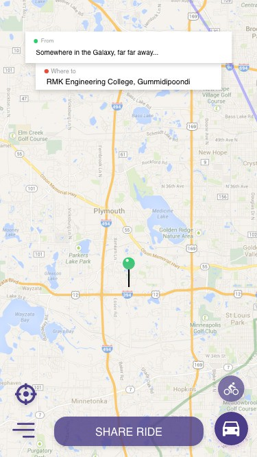
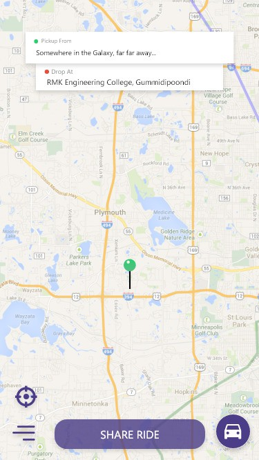
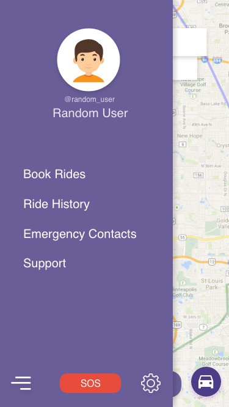
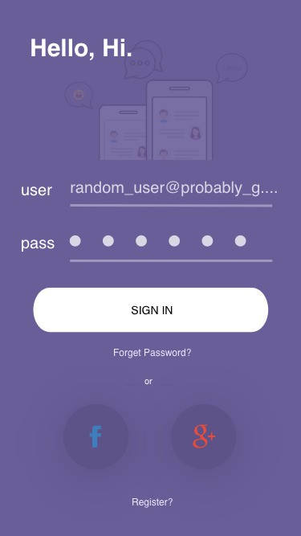
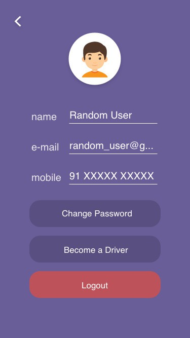
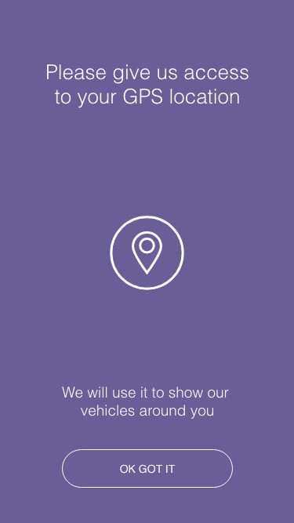

# Team #3
12th October, 2017

Matters that were taken into factor

- Devices Compatible
- Performance
- "Content Focus"
- iOS design guidelines

**Devices Compatibility**

While limited iOS11 availability really sucks, it opened new
opportunities to work with the UI, like the UI Designer need not match
all the screen sizes rather he has to support only for screen sizes for
devices in iOS compatible list.

**Performance**

Since iOS11 really centers around the ARkit it runs on devices are which
are cutting edge. This gives us opportunities to add more intense User
Interfaces designs such as Background blur.

**Content Focus**

Making the user focus on the content is important and is paramount for
any app. This boils down to one thing. Keeping the User Interface simple
and non-redundant as possible.

**iOS Design Guidelines**

Designs were done adhering(almost) to iOS Design Guidelines.

Onboarding
----------
# {width="2.609047462817148in" height="4.640625546806649in"}

This is visible to the user only for the first time of app usage. User
may re-view this again from the settings. This section can contain any
material which can promote the app.

Further, according to iOS Human Interface Guidelines, it is said that
users are more engaged to the app when the onboarding is simple and
really useful.

This page can also explain how AR can be used with this app.

Map
---
{width="3.0346150481189853in"
height="5.3975699912510935in"}

Unlike other mobile apps our app mainly focuses on the map. Here there isn't any separate wastage of screen which will completely suit iPhone X too. Along with that it gives an attractive look.

Button
------

Now if you take a close look at the fab button present at the
bottom-right corner the button dynamically changes to the vehicle that
has been chosen by the user(If we look at the previous page we can see
that there is no vehicle image in the button).This will enhance the
user's usage of this app.

And only if we select the vehicle type we will be able to view the share
ride button enabled.

Splash Screen
-------------
Even though splash screen might be cool and be way to promote brand name
name it is unnecessary, because the user may want to get to their
content directly when they tap the RideShare app icon on the Home
Screen.

And simply iOS Guidelines recommends not to use it.

From the wise words of Apple, "The launch screen is quickly replaced
with the first screen of your app, giving the impression that your app
is fast and responsive. The launch screen isn't an opportunity for
artistic"

Thus we can use a Launch screen which is a outline of our first page.

This subtle "trick" creates the illusion as if the app has loaded and
already started functioning.

Branding
--------
Utilizing a single color scheme helps a user to identify the brand of
the app, this is far more efficient than displaying the apps brand logo.

From the official guidelines, "Successful branding involves more than
just adding brand assets to your app. Great apps express unique brand
identity through smart font, color, and image decisions. Provide enough
branding to give people context in your app, but not so much that it
becomes a distraction."Now if we look at the various UI's or pages of
the app we can see that only one particular color has been that is
purple. This will make the user more comfortable in using this app.This
will not irritate the user's eyes as they are subtle and more
comfortable.

References
----------
[https://temp-mail.org/en/](https://temp-mail.org/en/)

[https://flatuicolors.com/](https://flatuicolors.com/)

[http://www.alfredocreates.com/](http://www.alfredocreates.com/)

[http://www.90daysui.com/](http://www.90daysui.com/)

[https://developer.apple.com/ios/human-interface-guidelines/overview/themes/](https://developer.apple.com/ios/human-interface-guidelines/overview/themes/)

[https://thenounproject.com/](https://thenounproject.com/)
