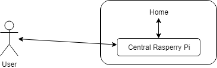
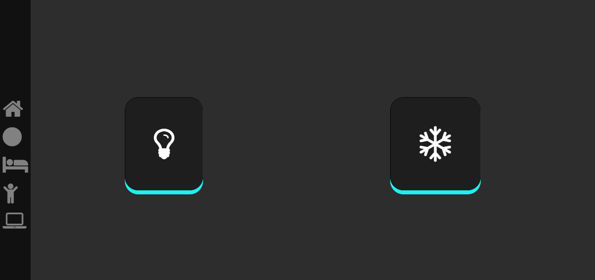
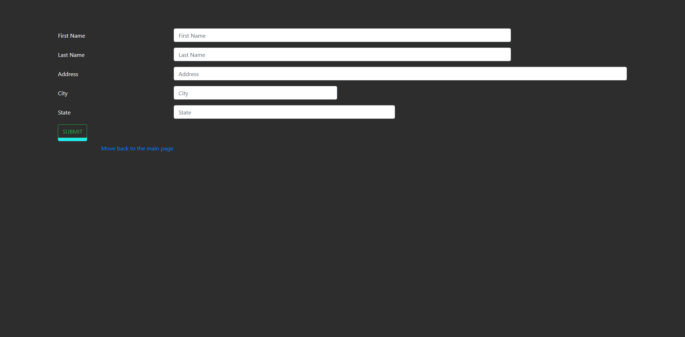

**Automation of home**

**[Introduction]{.ul}**

The ever growing workload of individuals can be crushing sometimes and
controlling our home with our fingertips can be something desirable. We
are proud to present a product which is cheap compared to the other
products present in the market. Our main aim is to make this product
available for all.

**[Problem Statement]{.ul}**

In recent years people are so relentless and are working so hard to earn
money and they want to spend their money to buy a big and luxurious
homes. Now when the house is big the distance between the switches for
light, fan or A/C is at a large distance so they have to do all these
things before they take rest, Thus we produce a solution by automating
the homes where they can operate the lights, fans and A/C's from
anywhere so that when they reach their home they can take rest. Along
with that in this busy world people tend to forget to switch off the
lights or fans thus it is waste of electricity and money as well.

**[Working]{.ul}**

-   The devices in a house (like lights, fans, A/C's ) are connected the
    > raspberry pi with the help of internet .

-   In-turn the user's smartphone or web-login and the raspberry server
    > is connected.

-   Thus the user can access the electronic device anytime from
    > anyplace.

-   We have also added an extra feature which is new among automation of
    > the home, the product is smart-mirror.

**[Use Case]{.ul}**

{width="3.8125in" height="1.2083333333333333in"}

**[Technology Stack]{.ul}**

1.  Front-End

    a.  XML (for android app)

    b.  Html, Javascript, Css(for web)

    c.  C and ncurses(for terminal based)

2.  Back-End

    a.  Node.js (for web)

    b.  Java (for android)

    c.  Embedded-C and Python (for Raspberry Pi)

**[Hardware Requirements]{.ul}**

1.  Raspberry Pi

2.  PIR sensor

3.  DHT 11/22 sensor

4.  Relay switch

5.  Connecting cable and jumper cables

**[Available System]{.ul}**

-   A product of
    > [[Rootefy]{.ul}](https://www.rootefy.com/affordable-2-bedroom-house-automation-package-1.html?fee=9&fep=5074&gclid=CjwKCAiA_c7UBRAjEiwApCZi8Qe7rOzs7w1FhNbzDMI9t_kWeQgtYUrzJhghJtXKygdPg8xQGXw1MhoCuHgQAvD_BwE)
    > is the only product available for home-automation.

-   This is our competitor but the cost is too high.

-   And allows the user to control it through app only.

**[Proposed System]{.ul}**

-   Cheaper and easily affordable

-   Users are allowed to control it using web-app and mobile app.

-   We have added smart-mirror feature to it.

**[Lines of code]{.ul}**

We use npm to manage dependencies throughout the project which uses the
following package.json

+-----------------------------------------------------------------------+
| **{**                                                                 |
|                                                                       |
| **\"\": \"package.json\",**                                           |
|                                                                       |
| **\"name\": \"smart-home\",**                                         |
|                                                                       |
| **\"version\": \"1.0.0\",**                                           |
|                                                                       |
| **\"description\": \"The web app for smarthome\",**                   |
|                                                                       |
| **\"scripts\": {**                                                    |
|                                                                       |
| **\"build\": \"tsc -p src/\",**                                       |
|                                                                       |
| **\"build:watch\": \"tsc -p src/ -w\",**                              |
|                                                                       |
| **\"build:e2e\": \"tsc -p e2e/\",**                                   |
|                                                                       |
| **\"serve\": \"lite-server -c=bs-config.json\",**                     |
|                                                                       |
| **\"serve:e2e\": \"lite-server -c=bs-config.e2e.json\",**             |
|                                                                       |
| **\"prestart\": \"npm run build\",**                                  |
|                                                                       |
| **\"start\": \"\\\"npm run serve\\\"\",**                             |
|                                                                       |
| **\"pree2e\": \"npm run build:e2e\",**                                |
|                                                                       |
| **\"e2e\": \"concurrently \\\"npm run serve:e2e\\\" \\\"npm run       |
| protractor\\\" \--kill-others \--success first\",**                   |
|                                                                       |
| **\"preprotractor\": \"webdriver-manager update\",**                  |
|                                                                       |
| **\"protractor\": \"protractor protractor.config.js\",**              |
|                                                                       |
| **\"pretest\": \"npm run build\",**                                   |
|                                                                       |
| **\"test\": \"concurrently \\\"npm run build:watch\\\" \\\"karma      |
| start karma.conf.js\\\"\",**                                          |
|                                                                       |
| **\"pretest:once\": \"npm run build\",**                              |
|                                                                       |
| **\"test:once\": \"karma start karma.conf.js \--single-run\",**       |
|                                                                       |
| **\"lint\": \"tslint ./src/\*\*/\*.ts -t verbose\"**                  |
|                                                                       |
| **},**                                                                |
|                                                                       |
| **\"keywords\": \[\],**                                               |
|                                                                       |
| **\"author\": \"\",**                                                 |
|                                                                       |
| **\"license\": \"MIT\",**                                             |
|                                                                       |
| **\"dependencies\": {**                                               |
|                                                                       |
| **\"\@angular/common\": \"\~4.3.4\",**                                |
|                                                                       |
| **\"\@angular/compiler\": \"\~4.3.4\",**                              |
|                                                                       |
| **\"\@angular/core\": \"\~4.3.4\",**                                  |
|                                                                       |
| **\"\@angular/forms\": \"\~4.3.4\",**                                 |
|                                                                       |
| **\"\@angular/http\": \"\~4.3.4\",**                                  |
|                                                                       |
| **\"\@angular/platform-browser\": \"\~4.3.4\",**                      |
|                                                                       |
| **\"\@angular/platform-browser-dynamic\": \"\~4.3.4\",**              |
|                                                                       |
| **\"\@angular/router\": \"\~4.3.4\",**                                |
|                                                                       |
| **\"angular-in-memory-web-api\": \"\~0.3.0\",**                       |
|                                                                       |
| **\"body-parser\": \"\^1.18.2\",**                                    |
|                                                                       |
| **\"bootstrap\": \"\^4.0.0\",**                                       |
|                                                                       |
| **\"core-js\": \"\^2.4.1\",**                                         |
|                                                                       |
| **\"express\": \"\^4.16.2\",**                                        |
|                                                                       |
| **\"font-awesome\": \"\^4.7.0\",**                                    |
|                                                                       |
| **\"fs\": \"0.0.1-security\",**                                       |
|                                                                       |
| **\"jquery\": \"\^3.3.1\",**                                          |
|                                                                       |
| **\"mongodb\": \"\^3.0.2\",**                                         |
|                                                                       |
| **\"popper.js\": \"\^1.12.9\",**                                      |
|                                                                       |
| **\"rxjs\": \"5.0.1\",**                                              |
|                                                                       |
| **\"socket.io\": \"\^2.0.4\",**                                       |
|                                                                       |
| **\"systemjs\": \"0.19.40\",**                                        |
|                                                                       |
| **\"tether\": \"\^1.4.3\",**                                          |
|                                                                       |
| **\"zone.js\": \"\^0.8.4\"**                                          |
|                                                                       |
| **},**                                                                |
|                                                                       |
| **\"devDependencies\": {**                                            |
|                                                                       |
| **\"\@types/jasmine\": \"2.5.36\",**                                  |
|                                                                       |
| **\"\@types/node\": \"\^6.0.46\",**                                   |
|                                                                       |
| **\"canonical-path\": \"0.0.2\",**                                    |
|                                                                       |
| **\"concurrently\": \"\^3.5.1\",**                                    |
|                                                                       |
| **\"jasmine-core\": \"\~2.4.1\",**                                    |
|                                                                       |
| **\"karma\": \"\^1.3.0\",**                                           |
|                                                                       |
| **\"karma-chrome-launcher\": \"\^2.0.0\",**                           |
|                                                                       |
| **\"karma-cli\": \"\^1.0.1\",**                                       |
|                                                                       |
| **\"karma-jasmine\": \"\^1.0.2\",**                                   |
|                                                                       |
| **\"karma-jasmine-html-reporter\": \"\^0.2.2\",**                     |
|                                                                       |
| **\"lite-server\": \"\^2.2.2\",**                                     |
|                                                                       |
| **\"lodash\": \"\^4.16.4\",**                                         |
|                                                                       |
| **\"protractor\": \"\~4.0.14\",**                                     |
|                                                                       |
| **\"rimraf\": \"\^2.5.4\",**                                          |
|                                                                       |
| **\"tslint\": \"\^3.15.1\",**                                         |
|                                                                       |
| **\"typescript\": \"\~2.1.0\"**                                       |
|                                                                       |
| **},**                                                                |
|                                                                       |
| **\"repository\": {}**                                                |
|                                                                       |
| **}**                                                                 |
+=======================================================================+
+-----------------------------------------------------------------------+

The server.js enables to run mongodb server

+-----------------------------------------------------------------------+
| //server.js                                                           |
|                                                                       |
| const express = require(\'express\');                                 |
|                                                                       |
| const bodyParser = require(\'body-Parser\');                          |
|                                                                       |
| const MongoClient = require(\'mongodb\').MongoClient;                 |
|                                                                       |
| const app = express();                                                |
|                                                                       |
| MongoClient.connect(\'mongodb://crpte                                 |
| rdine:Crypter2854\@ds241578.mlab.com:41578/smartmirror\',(err,client) |
| =>{                                                                   |
|                                                                       |
| if(err) return console.log(err);                                      |
|                                                                       |
| db=client.db(\'smartmirror\')                                         |
|                                                                       |
| app.listen(3004, function() {                                         |
|                                                                       |
| console.log(\'listening on 3004\')                                    |
|                                                                       |
| })                                                                    |
|                                                                       |
| })                                                                    |
|                                                                       |
| app.use(bodyParser.urlencoded({extended: true}))                      |
|                                                                       |
| app.get(\'/\',(req, res) =>{                                          |
|                                                                       |
| res.sendFile(\'src/mirror.html\')                                     |
|                                                                       |
| var                                                                   |
| cur                                                                   |
| sor=db.collection(\'register\').find().toArray(function(err,results){ |
|                                                                       |
| console.log(results)                                                  |
|                                                                       |
| })                                                                    |
|                                                                       |
| })                                                                    |
|                                                                       |
| app.post(\'/register\',(req, res) =>{                                 |
|                                                                       |
| db.collection(\'register\').save(req.body,(err,result) =>{            |
|                                                                       |
| if(err) return console.log(err)                                       |
|                                                                       |
| console.log(\'saved to database\');                                   |
|                                                                       |
| res.redirect(\'/\')                                                   |
|                                                                       |
| })                                                                    |
|                                                                       |
| })                                                                    |
|                                                                       |
| app.use(express.static(\'public\'))                                   |
+=======================================================================+
+-----------------------------------------------------------------------+

We use submit.js to handle the conversion from form to json and also to
check the validity of the form

+-----------------------------------------------------------------------+
| **[//submit.js]{.ul}**                                                |
|                                                                       |
| function handleFormSubmit(){                                          |
|                                                                       |
| var fs = require(\'fs\');                                             |
|                                                                       |
| var name = getElementById(\"firstname\").value;                       |
|                                                                       |
| var address=getElementById(\"Address\").value;                        |
|                                                                       |
| var city=getElementsById(\"City\").value;                             |
|                                                                       |
| var state=getElementsById(\"State\").value;                           |
|                                                                       |
| var                                                                   |
| js                                                                    |
| onD=\"{\\\"name\\\":\\\"\${name}\\\",\\\"address\\\":\\\"\${Address}\ |
| \\",\\\"city\\\":\\\"\${City}\\\",\\\"state\\\":\\\"\${State}\\\"}\"; |
|                                                                       |
| fs.writeFile(\"data.json\", jsonD, function(err) {                    |
|                                                                       |
| if(err) {                                                             |
|                                                                       |
| return console.log(err);                                              |
|                                                                       |
| }                                                                     |
|                                                                       |
| else {                                                                |
|                                                                       |
| console.log(name);                                                    |
|                                                                       |
| }}                                                                    |
|                                                                       |
| }                                                                     |
+=======================================================================+
+-----------------------------------------------------------------------+

The following index.html is the main file of our web interface and also
contains the css

+-----------------------------------------------------------------------+
| \<!\--index.html\--\>                                                 |
|                                                                       |
| \<body>                                                               |
|                                                                       |
| \
                                             |
|                                                                       |
| \<a href=\"index.html\"\>\<i class=\"fa fa-home fa-2x\"               |
| data-toggle=\"tooltip\" title=\"Main Page\"\>\</i>\</a>               |
|                                                                       |
| \<a href=\"mirror.html\"                                              |
| onclick=\"javascript:event.target.port=3000\"\>\<i class=\"fa         |
| fa-circle fa-2x\" data-toggle=\"tooltip\" title=\"Smart               |
| Mirror\"\>\</i>\</a>                                                  |
|                                                                       |
| \<a href=\"MasterBedRoom.html\"\>\<i class=\"fa fa-bed fa-2x\"        |
| data-toggle=\"tooltip\" title=\"Bedroom\"\>\</i>\</a>                 |
|                                                                       |
| \<a href=\"Hall.html\"\>\<i class=\"fa fa-child fa-2x\"               |
| data-toggle=\"tooltip\" title=\"Kids Room\"\>\</i>\</a>               |
|                                                                       |
| \<a href=\"Bedroom.html\"\>\<i class=\"fa fa-laptop fa-2x\"           |
| data-toggle=\"tooltip\" title=\"Gamer\'s Room\"\>\</i>\</a>           |
|                                                                       |
| \
                                                               |
|                                                                       |
| style-sheets:                                                         |
|                                                                       |
| .card-container-home {                                                |
|                                                                       |
| display: grid;                                                        |
|                                                                       |
| padding: 64px;                                                        |
|                                                                       |
| background-color: #2D2D2D;                                            |
|                                                                       |
| color: white;                                                         |
|                                                                       |
| text-align: center;                                                   |
|                                                                       |
| }                                                                     |
|                                                                       |
| .primary{                                                             |
|                                                                       |
| background-color: #2d2d2d;                                            |
|                                                                       |
| }                                                                     |
|                                                                       |
| .col-form-label{                                                      |
|                                                                       |
| color: white;                                                         |
|                                                                       |
| }                                                                     |
|                                                                       |
| .text-style{                                                          |
|                                                                       |
| color: white;                                                         |
|                                                                       |
| }                                                                     |
|                                                                       |
| .fill{                                                                |
|                                                                       |
| min-height: 100%;                                                     |
|                                                                       |
| height: 100%;                                                         |
|                                                                       |
| }                                                                     |
|                                                                       |
| ...                                                                   |
|                                                                       |
| angular-loader file:                                                  |
|                                                                       |
| var templateUrlRegex =                                                |
| /templateUrl\\s\*:(\\s\*\[\'\"\`\](.\*?)\[\'\"\`\]\\s\*)/gm;          |
|                                                                       |
| var stylesRegex = /styleUrls \*:(\\s\*\\\[\[\^\\\]\]\*?\\\])/g;       |
|                                                                       |
| var stringRegex = /(\[\'\`\"\])((?:\[\^\\\\\]\\\\\\1\|.)\*?)\\1/g;    |
|                                                                       |
| module.exports.translate = function(load){                            |
|                                                                       |
| if (load.source.indexOf(\'moduleId\') != -1) return load;             |
|                                                                       |
| var url = document.createElement(\'a\');                              |
|                                                                       |
| url.href = load.address;                                              |
|                                                                       |
| var basePathParts = url.pathname.split(\'/\');                        |
|                                                                       |
| basePathParts.pop();                                                  |
|                                                                       |
| var basePath = basePathParts.join(\'/\');                             |
|                                                                       |
| var baseHref = document.createElement(\'a\');                         |
|                                                                       |
| baseHref.href = this.baseURL;                                         |
|                                                                       |
| baseHref = baseHref.pathname;                                         |
|                                                                       |
| **.**                                                                 |
|                                                                       |
| **.**                                                                 |
|                                                                       |
| **.**                                                                 |
|                                                                       |
| **\</body>**                                                          |
+=======================================================================+
+-----------------------------------------------------------------------+

**[Output
Screenshot]{.ul}**{width="5.6026301399825025in"
height="2.838542213473316in"}

{width="5.578125546806649in"
height="2.631540901137358in"}

{width="5.583748906386702in"
height="2.7552088801399823in"}

**[Conclusion]{.ul}**

Let's fulfill the dreams of Late.Dr. APJ Abdul Kalam's India 2020. We
are trying to take part in achieving the dreams of our beloved President
and our project stands as the proof of it.
